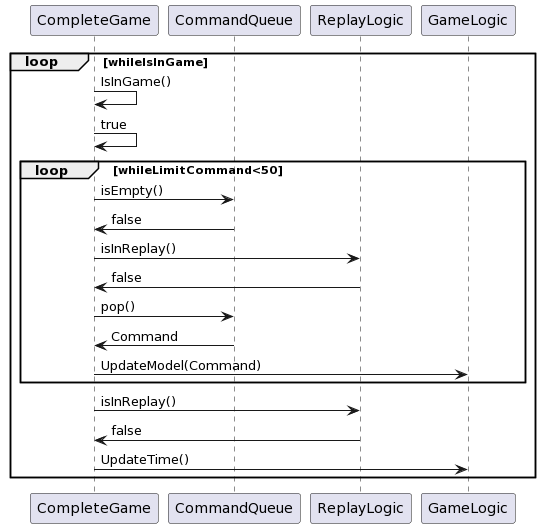

<h1>DOCUMENTACIÓN TÉCNICA </h1>
<h3>TALLER DE PROGRAMACIÓN I</h3>
<h3>2º Cuatrimestre 2022</h3>

### integrantes:

* **Ignacio Garcia Segovia** - [1gnacio](https://github.com/1gnacio)
* **Nahuel Gomez** - [NahuelNGomez](https://github.com/NahuelNGomez)
* **Iñaki González Bigliardi** - [igonzalezb](https://github.com/igonzalezb)

### Indice:

1) **Composición del protocolo.**
2) **Archivos.**
3) **Test unitarios.**
4) **Diagramas.**
-----------

### Composición del protocolo:

-----------

### Archivos:

#### <u>Server</u>

**<u>Descrición general:</u>**

Esta entidad se encarga de:
* Recibir a nuevos clientes.

* Distribuir a los clientes en la partida correspondiente.

* Resolver la lógica del juego (de todas las partidas en simultáneo).

* Posee la información de las salas.

* Envía a los clientes las respuestas correspondientes con los datos de su partida.

*Clases sobre el juego:*
1) **GameModel:** Se encarga de la distribución de cada jugador a una partida. Le irán llegando
comandos y, dependiendo el tipo de comando, lo trabajará o derivará a la cola de comandos
de la partida correspondiente.

2) **CompleteGame:** Posee el loop principal del juego, a la vez que contiene la información de la
sala (está empezada, qué jugadores la integran, etc.).

3) **GameLogic:** Le llegan comandos sobre los movimientos que se han realizado durante el juego y
se encarga de manipularlos a partir de la clase BoxLogic.

4) **BoxLogic:** Es un objeto que se encarga de manipular la física de cada partida a partir de la
librería box2D. En ella se encuentran los objetos del propio juego, como por ejemplo los autos;
el propio mundo; la pelota; entre otros.

5) **Game:** Tiene la información de la partida y sabe si una partida terminó. Tiene atributos como
goalsLocal / goalsVisitor (cuántos goles hay en la partida) o el tiempo de la partida.

6) **ContactListenerHits:** Es una clase que hereda de b2ContactListener(propia de la librería box2D)
que se encarga de informar las interacciones entre la pelota y el auto. A su vez, tiene la
capacidad de comunicarle a la pelota con qué golpe ha sido golpeada.

7) **ReplayLogic:** Es capaz de almacenar respuestas para que, una vez que haya existido un gol, se
envíen sus respuestas en lugar de las del propio juego.

8) **Car:** Es un objeto que simula al auto en el juego. Este tiene la capacidad de saber cuándo hacer
un flip, saber si está en el suelo; su estado en el tanque de turbo, entre otras cosas.

9) **Ball:** Clase que se encarga de simular a la pelota dentro de la partida. Tiene la capacidad de
saber si ha sido golpeada con algún movimiento especial y de ser cierto, se aplica una fuerza
extra.

*Clases sobre la conexión:*

1) **ServerEndpoint**:

2) **ServerConnection**:

3) **ResponseHandler**:

4) **IdService**:

5) **CommandHandler**:

#### <u>Cliente</u>
Esta entidad se encarga de:

* La interacción con el usuario a través del teclado y el mouse.

*  Mostrar en pantalla la interfaz gráfica del lobby y el juego principal.

* Conexión con el servidor y recibe las respuestas.

*Clases sobre el juego:*

1) **Client:** esta clase es el loop principal por el cual a partir de una respuesta del servidor de una cola no bloqueante, actualiza los modelos y luego renderiza la pantalla. 

2) **lobby:** clase de qT que muestra una ventana del lobby por el cual los usuarios crean partidas o se unen a alguna ya creada previamente.

3) **sdl_main:** esta clase es la principal de SDL. Posee el resto de los objetos de SDl y la misma tiene dos funciones principales. Una actualiza los datos de todos los modelos de SDl y la otra renderiza los objetos.

4) **unit_conversion:** se encarga de la conversión de unidades entre Box2D y SDl. Ya sea convertir de metros a pixeles o radianes a grados.

5) **sdl_animation:** esta clase genera animaciones a partir de imágenes estáticas al ir cambiando de frames.

6) **sdl_music:** clase que maneja los sonidos del juego.

7) **sld_{objeto}:** cada objeto de SDL tiene su clase, ya sea los *autos*, *arena*, *scoreboard*, etc. Tienen dos funciones principales: *update* y *render*.

*Clases sobre la conexión:*

1) ****:

2) ****:

3) ****:

4) ****:

5) ****:
---------

### Diagramas:

<u>***Flujo principal del juego en una partida comenzada***</u>

A continuación, mostramos un diagrama de secuencia donde se aprecia el flujo estándar del juego:

-----------

### Test unitarios:

-----------
