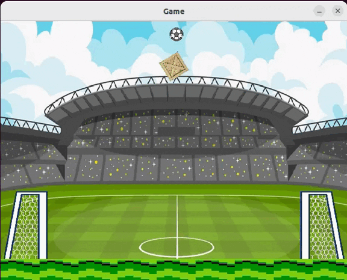

# Taller-1-Rocket-League

## Importante: como correr el TP (por ahora)

1 - Build

    git submodule init
    git submodule update  
    mkdir build
    cd build
    cmake ..
    make -j4

2 - Execute (desde la carpeta build)

    ./testing

## Grupo 1

* **Ignacio Garcia Segovia** - [1gnacio](https://github.com/1gnacio)
* **Nahuel Gomez** - [NahuelNGomez](https://github.com/NahuelNGomez)
* **Iñaki Gonzalez Bigliardi** - [igonzalezb](https://github.com/igonzalezb)

Corrector: Martin

## Lobby

## Documentación & Notas

[Link Google Docs](https://docs.google.com/document/d/1HAAGN4PyoHdXEmL62-MtdpeMkoSojueFdWUvSQ4e9Ag/edit?usp=sharing)

[EverNote](https://www.evernote.com/shard/s392/client/snv?noteGuid=1dd9e1ff-3bbe-c34f-33f0-5545271bdf81&noteKey=8f2645c4fdc094c5fc3e4e4d6d404fc8&sn=https%3A%2F%2Fwww.evernote.com%2Fshard%2Fs392%2Fsh%2F1dd9e1ff-3bbe-c34f-33f0-5545271bdf81%2F8f2645c4fdc094c5fc3e4e4d6d404fc8&title=TP1%2B-%2BAPUNTES)

## Juego

## Lista de requerimientos *TODO*

* Simular trayectoria de pelota, autos y tiros especiales (habria que definir alcances de cada uno) con Box2D

### Autos

* Movimiento horizontal, salto simple y doble, piruetas.
* Tanque de nitro para moverse mas rapido
* Disparos especiales a partir del segundo salto segun el lugar de impacto de la pelota en el vehiculo

#### Saltos

* Golpear la pelota en el aire
* Salto doble disponible una sola vez hasta que vuelve a tocar el suelo

##### Flips

* Se activa con el segundo salto y una direccion 
* Impulsa al auto en esa direccion

#### Turbo

* Limitado (por tiempo, cantidad de usos?) 
* Aumenta la velocidad del auto durante el uso 
* Se recarga por tiempo con el auto en el suelo
* Si se usa en el aire, el auto debe volar hacia donde apunte la trompa

#### Disparos

* Golpe de pelota con el auto acercandose en velocidad
* Disparos especiales:
  * Flip shot:
    * Golpe de pelota luego de hacer un flip
    * Impulso bajo de pelota
  * Red shot:
    * Golpe fuerte de pelota luego de un flip
    * El auto debe estar muy cerca de la pelota
    * El auto debe impactar con la trompa
    * Impulso alto de pelota
  * Purple shot
    * Golpe medio de pelota con la parte baja del auto
    * Impulsa al auto en direccion contraria al de la pelota
  * Gold shot
    * Golpe fuerte con la parte trasera del auto
    * Impulsa al auto en direccion contraria al de la pelota

#### Colisiones

* No chocan entre si
* Impactan a la pelota
* Pueden andar por las paredes (se caen?)
    
### Partido

* 3 minutos configurable
* Al finalizar, mostrar estadisticas de goles, asistencias y atajadas

### Escenario

* Fondo 2D de una cancha de futbol de perfil

### Camara

* Fija
* Muestra la cancha de perfil

### Repeticiones

* Mostrar repeticion del gol

### Interfaz grafica

* Tiempo restante de juego
* Marcador
* Nitro restante del jugador

### Animaciones

* Movimiento del auto cuando gira
* Humo cuando activa nitro
* Giro de pelota cuando esta en movimiento
* Explosiones cuando se hace un gol

### Sonidos y musica

  * Salto
  * Nitro
  * Gol
  * Golpe de pelota
  * Recomendacion: evitar sonidos si hay muchos en reproduccion (no obligatorio)
  * Musica de ambiente baja

### Configuracion

  * Todo configurable (velocidad, altura de salto, fuerza gravitatoria, elasticidad de pelota, etc) 
  * Archivo YAML
  
  
### Cliente

* Conectarse al servidor, crear, unirse a partida
* Mostrar y jugar al juego

### Servidor

* Multiples partidas en simultaneo
* Enviar a los clientes partidas creadas y disponibles para unirse
* Asignacion aleatoria de equipo del jugador
* Identificacion de equipos por color
  
### Tests

* Cliente y servidor con suite de tests unitarios
* Coverage:
  * Protocolo 100%
  * Logica de partidas 60%
  
