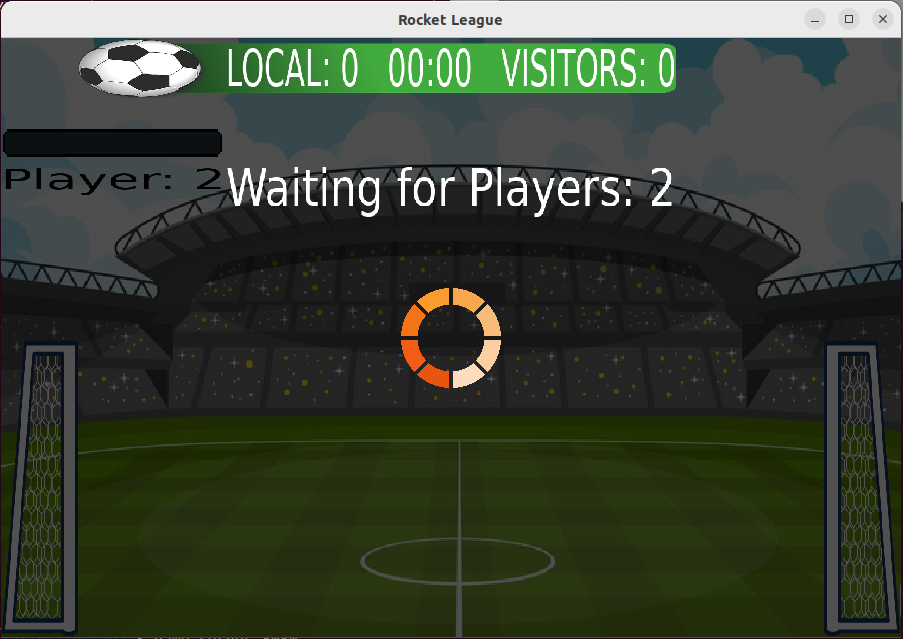
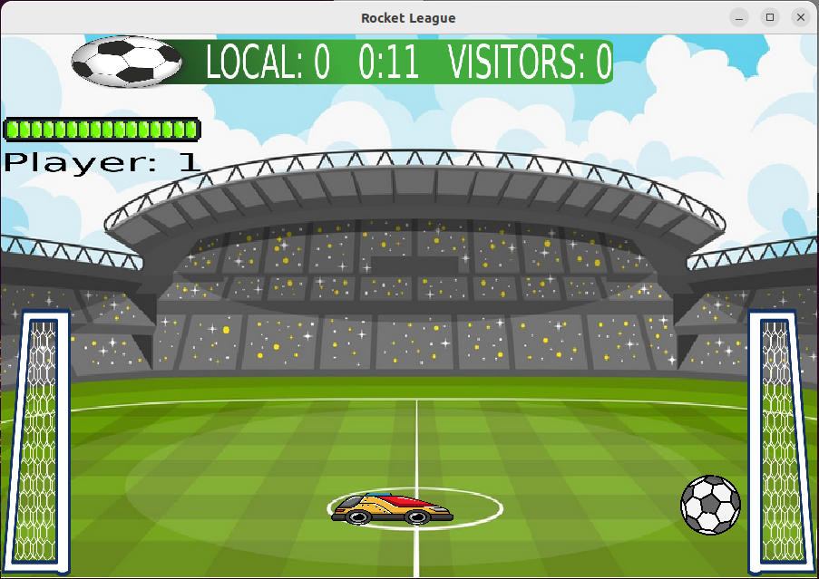
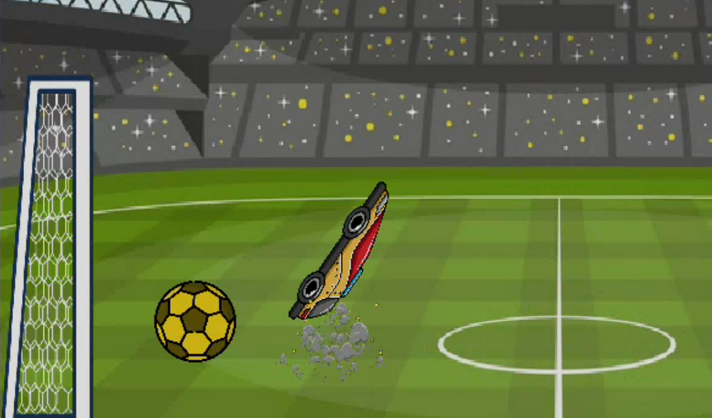

# Taller-1-Rocket-League

## Grupo 1

* **Ignacio Garcia Segovia** - [1gnacio](https://github.com/1gnacio)
* **Nahuel Gomez** - [NahuelNGomez](https://github.com/NahuelNGomez)
* **Iñaki Gonzalez Bigliardi** - [igonzalezb](https://github.com/igonzalezb)

Corrector: Martin

## Manual de usuario

### Introduccion

El presente trabajo consiste en diseniar e implementar una version simplificada en 2D del juego de celular Rocket League: Sideswipe.
El juego consiste en un partido de fútbol, en donde los jugadores son autos que pueden hacer distintos movimientos para poder empujar una pelota dentro del arco contrario.

### Requerimientos de software

Sistema operativo: Ubuntu --AGREGAR VERSION--  
  
Listado de dependencias del proyecto

- [cmake](https://cmake.org/)
- [yaml](https://yaml.org/)
- [X.Org](https://www.x.org/wiki/)
- [SDL2](https://github.com/libsdl-org/SDL)
- [SDL_image](https://github.com/libsdl-org/SDL_image)
- [SDL_ttf](https://github.com/libsdl-org/SDL_ttf)
- [SDL_mixer](https://github.com/libsdl-org/SDL_mixer)
- [libSDL2pp](https://github.com/libSDL2pp/libSDL2pp)
- [QT5](https://wiki.qt.io/Install_Qt_5_on_Ubuntu)


## Instalacion

Paso 1: Clonar el repositorio

```console
    git clone git@github.com:1gnacio/Taller-1-Rocket-League.git
```

Paso 2: Correr los siguientes comandos:

```console
    cd Taller-1-Rocket-League
    sh installer.sh
```

## Desinstalación 

Se deberá correr el siguiente comando en la carpeta del repositorio:

```
    sh desinstaller.sh <flag>
```
Los flags autorizados son:

- `--game`: Eliminación de los archivos del juego.

- `--qt`: Eliminación de las dependencias de qt.

- `--sdl`: Eliminación de las dependencias de sdl.

- `--yaml`: Eliminación de las dependencias de yaml-cpp.

- `--cpp`: Borra dependencias de: clang, cmake, make, build-essential.

- `--repo`: Borra el repositorio

- `--all`: Elimina las dependencias del juego, qt; sdl2; yaml-cpp; clang; cmake; make; build-essential; el propio juego; el repositorio 

## Inicializar servidor y cliente  

Luego de la instalación, se generarán dos ejecutables: game_server y game_client.
Al estar localizados en la carpeta /usr/bin podemos acceder a ellos de manera global
desde cualquier 
parte de nuestra terminal.

**Correr el servidor**  

```console
game_server <puerto>
```

Al correr este comando se inicia el servidor, dejando la consola en modo de espera hasta que el usuario ingrese la letra `q` y presione enter para cerrar el servidor. Durante este tiempo el servidor se encuentra esperando conexiones de jugadores  
  
**Correr el cliente**  

```console
game_client <nombre_del_servidor> <puerto>`
```

Para partidas locales recomendamos los puertos `8080` u `8088`.

## Ciclo de juego

Al conectarse al servidor, el jugador vera la siguiente interfaz grafica que representa el lobby del juego, donde se pueden crear, visualizar y unir a partidas


### Acciones desde el lobby

* **Crear**: el jugador podra crear una partida nueva escribiendo el nombre y la cantidad maxima permitida de jugadores. El servidor valida que no existan partidas con el mismo nombre ya empezadas. Una vez creada correctamente la partida, el jugador se conectara a la misma y vera en pantalla el campo de juego con su auto asignado.

* **Unirse**: el jugador podra unirse a una partida existente eligiendola desde la lista que se encuentra en la parte inferior de la ventana. Si no encuentra la partida en la interfaz, haciendo click en _Refresh_ se volveran a cargar las partidas disponibles y su estado. Solo podra unirse a aquellas partidas que no se encuentren llenas o terminadas.


En todo momento el jugador podra salir de la partida haciendo click en la cruz de la ventana de partida, la cual volvera abrir el lobby para unirse a otra partida o crear una nueva. Al cerrar la ventana de lobby el cliente se desconecta del servidor.


## Juego

Al unirse o crear una partida, el jugador será llevado al campo de juego.

En este momento, podrá ver que la partida está en espera si es que faltan jugadores, o de lo contrario, empezará a jugar.
La imagen a continuación muestra a un jugador esperando a su contrincante:



En la pantalla, podrá ver:

- Marcador: Contiene los goles anotados por cada equipo y el tiempo transcurrido de la partida.
- Barra de turbo: Ubicada en la esquina superior izquierda, se encarga de transmitirle al jugador sobre el estado de su
tanque de nitro.
- Indicador de ID: Inferior a la barra se encuentra al indicador cuál es su ID.
- Arcos: A ambos extremos de la cancha se encuentran los dos arcos, donde la pelota debe llega para anotar un gol.
- Pelota: De manera clásica se encuentra la pelota con la que se jugará la partida.
- Autos: Cada jugador podrá manejar un solo auto.



## Modo de juego

El jugador podrá hacer los movimientos estándar de su auto mientras esté en el suelo con las flechas del teclado.
-  ↤ (flecha lateral izquierda): El auto se moverá hacia la izquierda de la cancha.


-  ↦ (flecha lateral derecha): El auto se moverá hacia la derecha de la cancha.


- barra espaciadora: El auto saltará por los aires.


- tecla T: Se activará el turbo. (Se recomienda mantenerlo presionado para tener un mayor efecto).

Mientras el auto se podrán utilizar teclas para crear movimientos especiales:

- Todas las flechas del teclado: Provocarán un torque al auto. Se debe tener en cuenta que el juego sabe cuál de estas teclas fue la última precionada.


- Barra espaciadora: Dependiendo la última tecla de flechas presionada durante el aire el auto hará un FLIP en esa dirección. Si no se preciosa ninguna tecla
El auto no hará un flip, sino que saltará normalmente.


**Golpes especiales:**

Luego del segundo FLIP el auto queda cargado de energía, lo que provoca que, si toca la pelota al instante de realizarlo, esta recibirá
un impulso de fuerza adicional.
Estos golpes especiales pueden ser de 4 tipos diferentes:
1) FLIP SHOT: El auto choca con la parte superior de la pelota luego de hacer el FLIP. (Potencia adicional: 1)

2) RED SHOT: El auto choca con la parte delantera de la pelota luego de hacer el FLIP. (Potencia adicional: 3)

3) PURPLE SHOT: El auto choca con la parte inferior de la pelota luego de hacer el FLIP. (Potencia adicional: 5)

4) GOLD SHOT: El auto choca con la parte trasera de la pelota luego de hacer el FLIP. (Potencia adicional: 10)

**Visualización de GOLDSHOT**




## Documentación & Notas

[Link Google Docs](https://docs.google.com/document/d/1HAAGN4PyoHdXEmL62-MtdpeMkoSojueFdWUvSQ4e9Ag/edit?usp=sharing)

[EverNote](https://www.evernote.com/shard/s392/client/snv?noteGuid=1dd9e1ff-3bbe-c34f-33f0-5545271bdf81&noteKey=8f2645c4fdc094c5fc3e4e4d6d404fc8&sn=https%3A%2F%2Fwww.evernote.com%2Fshard%2Fs392%2Fsh%2F1dd9e1ff-3bbe-c34f-33f0-5545271bdf81%2F8f2645c4fdc094c5fc3e4e4d6d404fc8&title=TP1%2B-%2BAPUNTES)
