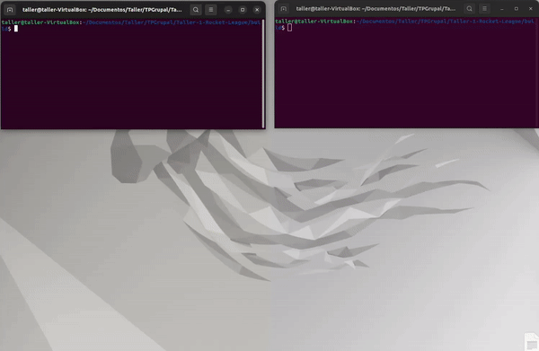

# Taller-1-Rocket-League

## Grupo 1

* **Ignacio Garcia Segovia** - [1gnacio](https://github.com/1gnacio)
* **Nahuel Gomez** - [NahuelNGomez](https://github.com/NahuelNGomez)
* **Iñaki Gonzalez Bigliardi** - [igonzalezb](https://github.com/igonzalezb)

Corrector: Martin

## Build

### Dependencies

- [cmake](https://cmake.org/)
- `libyaml-cpp-dev`, `xorg-dev`, `libsdl2-dev`, `libx11-dev`, `libxrandr-dev`, `libxinerama-dev`, `libxcursor-dev`
  - Debian based distros: `sudo apt install libyaml-cpp-dev xorg-dev libsdl2-dev libx11-dev libxrandr-dev libxinerama-dev libxcursor-dev`
- [SDL2](https://github.com/libsdl-org/SDL)
- [SDL_image](https://github.com/libsdl-org/SDL_image)
- [SDL_ttf](https://github.com/libsdl-org/SDL_ttf)
- [SDL_mixer](https://github.com/libsdl-org/SDL_mixer)
- [libSDL2pp](https://github.com/libSDL2pp/libSDL2pp)
- [QT5](https://wiki.qt.io/Install_Qt_5_on_Ubuntu)


### Building
```
    mkdir build
    cd build
    cmake ..
    make -j4
```

## Running

Server: `./game_server <puerto>`  
Para partidas locales recomendamos los puertos `8080` u `8088`

Client: `./game_client <nombre del servidor> <puerto>`

## Testing 
Para correr los test y ver el coverage por archivo
```
    cmake ..
    make scrub
    make gcov
```

## Lobby


## Juego


## Ejemplo integrador




## Documentación & Notas

[Link Google Docs](https://docs.google.com/document/d/1HAAGN4PyoHdXEmL62-MtdpeMkoSojueFdWUvSQ4e9Ag/edit?usp=sharing)

[EverNote](https://www.evernote.com/shard/s392/client/snv?noteGuid=1dd9e1ff-3bbe-c34f-33f0-5545271bdf81&noteKey=8f2645c4fdc094c5fc3e4e4d6d404fc8&sn=https%3A%2F%2Fwww.evernote.com%2Fshard%2Fs392%2Fsh%2F1dd9e1ff-3bbe-c34f-33f0-5545271bdf81%2F8f2645c4fdc094c5fc3e4e4d6d404fc8&title=TP1%2B-%2BAPUNTES)


